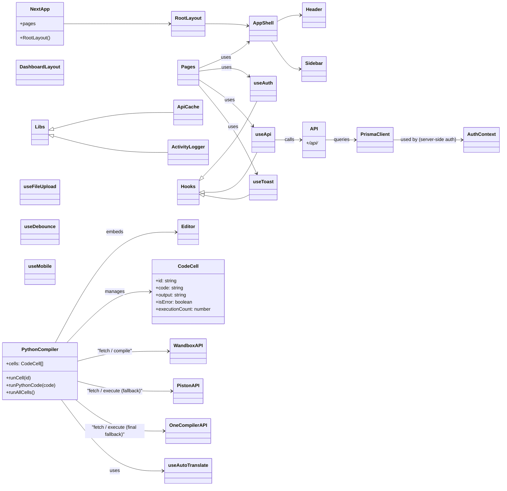
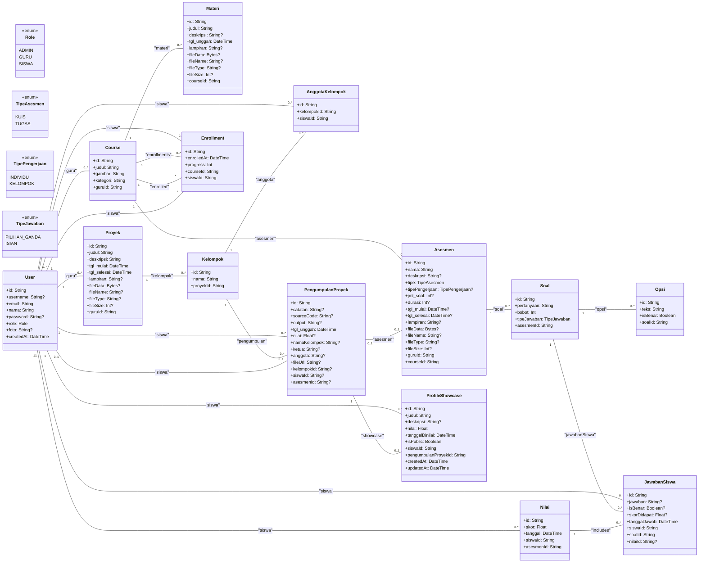

# Class Diagram — Projecta

File ini berisi diagram kelas (sederhana dan terfokus) dari arsitektur Projecta.
Diagram dibuat dalam format Mermaid supaya mudah dibuka di GitHub/VSCode yang mendukung Mermaid.

> Catatan: diagram ini disederhanakan untuk kemudahan pemahaman (frontend, hooks, lib, API, dan model DB utama).

## 1) High-level frontend / backend overview

## 2) Prisma data model (lengkap)

## 3) Catatan singkat / keterbacaan
- Diagram ini menyederhanakan banyak detail implementasi (props, util functions, file-level helpers).  
- Periksa `components/`, `hooks/`, `lib/`, `app/api/` dan `prisma/schema.prisma` untuk detail yang lengkap.

---

Jika ingin, saya bisa juga:
- menambahkan diagram sequence (mis. alur `PythonCompiler.runCell()` → API eksternal → response)
- eksport diagram ke PNG dan menaruhnya di `docs/` untuk mudah dibuka di luar GH

File ini dibuat otomatis. Jika mau tambahan, sebutkan tipe diagram yang diinginkan.
